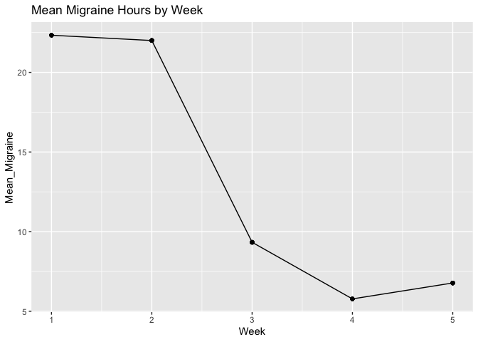

One Way ANOVA Within
================

## Relaxation Therapy effect on Migraines Example

``` r
library(pacman) #this package lets you load in multiple packages just by comma separation
pacman::p_load(psych, car, ggplot2, foreign, haven, nortest, psych, Rmisc, tidyverse, emmeans, rstatix, ggpubr, reshape2)
```

#### Read in data

``` r
lab <- read.spss("Class.e.g.13Tab14-3.sav", to.data.frame = T)
```

#### Change data frame from wide to long -&gt; collapses weeks into one column

``` r
lab.melt <- melt(lab, id="Subject")
colnames(lab.melt) = c("Subject","Week", "Migraine.hours")
```

#### Perform the ANOVA

``` r
ind.anova <- aov(Migraine.hours ~ Week+Error(factor(Subject)), data = lab.melt)
summary(ind.anova)
```

    ## 
    ## Error: factor(Subject)
    ##           Df Sum Sq Mean Sq F value Pr(>F)
    ## Residuals  8  486.7   60.84               
    ## 
    ## Error: Within
    ##           Df Sum Sq Mean Sq F value Pr(>F)    
    ## Week       4 2449.2   612.3   85.04 <2e-16 ***
    ## Residuals 32  230.4     7.2                   
    ## ---
    ## Signif. codes:  0 '***' 0.001 '**' 0.01 '*' 0.05 '.' 0.1 ' ' 1

#### Graphing

``` r
#Change factor to numeric or else line in graph won't show up
lab.melt$Week <- as.numeric(lab.melt$Week)

#make new column of means
lab.melt$Mean_Migraine <- ave(lab.melt$Migraine.hours, lab.melt$Week)

#plot
ggplot(lab.melt, aes(x=Week, y=Mean_Migraine, Week = factor(5))) +
  geom_line() +
  geom_point() + 
  ggtitle("Mean Migraine Hours by Week")
```

<!-- -->
